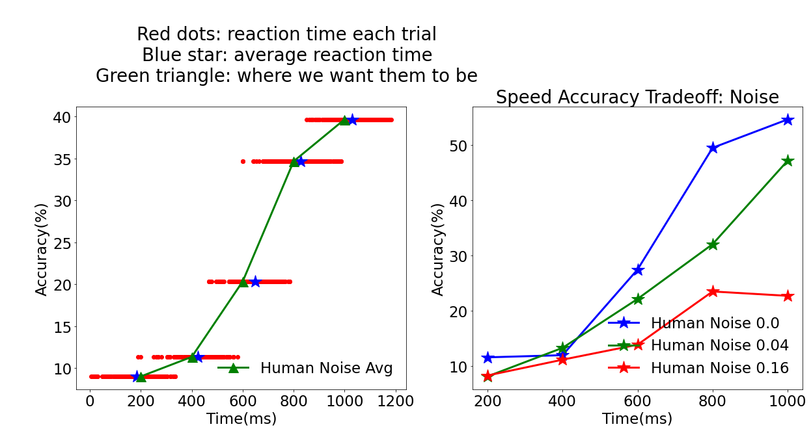

# HumanRT
SAT based data collected from humans in the presense of noise, blur and color.

* Citation for Data: https://osf.io/zkvep
* Visualizations website: https://human-rt.netlify.app


## About
Data collected on human reaction time on an object recognition task with increasing difficulty by having a rigid time regime and pertubations.

## Motivation
Neural networks have been shown to exhibit remarkable object recognition performance. We ask here whether such networks can provide a useful model for how people recognize objects. Human recognition time varies, from 0.1 to 10 s, depending on the stimulus and task. Slowness of recognition is a key feature in some public health issues, such is dyslexia, so it is crucial to create a model of human speed-accuracy trade-offs. This is a crucial aspect of any useful computational model of human cognitive behavior. We present a benchmark dataset for human speed-accuracy trade-off in recognizing a CIFAR-10 from a set of provided class labels.


## Demographic Information
We collect performance statistics from 33 observers (22 Male, 11 Female) with ages ranged from 24 to 62 years, and who who agreed to participate in an hour long session. Each observer had a normal or corrected-to-normal vision. 

## Process
The stimuli were presented via JATOS survey via worker links to each observer. A standard IRB approved consent form was signed before collecting the data by each observer, and demographic information was collected. For different perturbations, observers were given specific instructions to complete the survey. 

Prior to the study, subjects were instructed that image categories were linked to key presses of their letters (A)irplane, a(U)tomobile, (B)ird, (C)at, d(E)er, (D)og, (F)rog, (H)orse, (S)hip and (T)ruck. They also has a training run of 20 images where they learned the key-class labels and were given feedback on the speed of their responses.

Stimuli images were scaled to 190x190 pixels for optimal viewing.The survey was designed on five fixed viewing conditions (blocks) of 200 ms, 400 ms, 600 ms, 800 ms, and 1000 ms with a tolerance of 100 ms. Outside of these tolerance values, trials were discarded.

For noise and blur surveys, each time condition block consisted of 300 trials (1500 trials in total) while the color survey had 100 trials (500 trials in total). At the end of the time-limit for a trial, a beep sounded within 60 ms of which the observer had to enter their category decision via key-press after which feedback was given: if they were quick, slow or perfect while pressing the key.

## Visualizations
You can view all observers and their reaction time on: https://human-rt.netlify.app
It includes data for all observers for different perturbations.



* The plot on the left shows if protocol was followed while taking the survey. For each timed conditions, an observer is expected to be around it. A good observer follows protocol and submits a key press around the beep indicating protocol was followed. 
* Plot on the right demonstrates speed-accuracy trade-off at different perturbation conditions which tune the difficulty of the survey. For example, for high noise, an observer is expected to have a lower performance. 

## Dataset Description

Dataset for all the perturbations is provided in the links listed below. Dataset was collected in the form of surveys and has information related to reaction time and noise.
The jupyter notebooks provided showcase how to process the dataset and create a benchmark for modeling human reaction time. Each psychometric function or data collected from a single observer is in the form of a json text file which can be imported as a dataframe using pandas as:

```python
import pandas as pd
with open(file_path,'rb') as f:
    df = pd.read_json(f)
```
We collect personal information in the form of gender, age, and if glasses were used during taking the survey. You can view the information by accessing the first row of the dataframe.
We used lab.js for designing our survey and you can know more about it at:
https://labjs.readthedocs.io/en/latest/learn/builder/
```python
df[['do-you-agree-to-participate-and-are-you-above-18-years-old.-undefined',
    'what-describes-you-best-(male-female-others-prefer-not-to-say)',
    'please-enter-your-age-in-years.-(digits-only)',
    'do-you-need-glassescontact-lenses-to-read',
    'are-you-wearing-them-(put-']].iloc[0]
>> 
do-you-agree-to-participate-and-are-you-above-18-years-old.-undefined       1
what-describes-you-best-(male-female-others-prefer-not-to-say)           Male
please-enter-your-age-in-years.-(digits-only)                              39
do-you-need-glassescontact-lenses-to-read                                  no
are-you-wearing-them-(put-                                                n/a
Name: 0, dtype: object
```
Information related to survey data is based on the following columns recorded during taking the survey. 
```python
df[['sender', 'duration', 'timestamp','category', 
    'looper', 'response', 'correctResponse']][62:70]
```
The dataframe has columns for:
`sender`: defines page that was rendered during taking the survey. Important fields are 
* `Response`: collects information related to `duration`(ms) and `response`(categories) which indicate if the observer answered a question with a valid category in the given timeframe.
* `inter-stimulus`: this page follows `Response` page and used for giving feedback regarding the speed of the observer and in the background has information related to perturbations and category in the `correctResponse` field. For example in the noise survey: 0.04_horse_21.png means the image was of category `horse`, had a noise of SD `0.04`.
* `Tutorial1000` : we first take a tutorial survey of 20 images at 1000ms to help observers get used to the process of the survey
* `Trial_xx` : xx defines the timing conditions in ms- 1000,800,600,400,200. They are also known as a block of trials. 
* `duration` : records the time in ms spent on a particular page.
* `timestamp` : timestamp when a page was rendered. Useful for collecting the time taken for completing a survey. 
```python
(df.iloc[-1]['timestamp'] - df.iloc[0]['timestamp']).total_seconds() / 60
>> 63.09755
```
* `looper` : looping element which is used for displaying the progress of the survey.
* `category` : shows which category was displayed during the trial.
* `response` : useful for understanding which key was pressed during a particular screen was show. We only use it in conjunction with the `Response` field. 
* `correctResponse` : Has information related to perturbation added to CIFAR10 image. 


|    | sender         | duration  | timestamp                        | category | looper | response   | correctResponse      |
|----|----------------|-----------|----------------------------------|----------|--------|------------|----------------------|
| 62 | Tutorial1000   | 70117.321 | 2021-04-28 16:28:52.398000+00:00 |          |        |            |                      |
| 63 | Instructions   | 7127.652  | 2021-04-28 16:28:59.546000+00:00 |          |        |            |                      |
| 64 | Response       | 1201.191  | 2021-04-28 16:29:00.830000+00:00 | horse    | 0      |            |                      |
| 65 | inter-stimulus | 1182.985  | 2021-04-28 16:29:02.029000+00:00 | horse    | 0      | space      | 0.04_horse_21.png    |
| 66 | Trial_1000     | 2384.176  | 2021-04-28 16:29:02.029000+00:00 | horse    | 0      |            |                      |
| 67 | Response       | 1060.037  | 2021-04-28 16:29:03.158000+00:00 | airplane | 1      | automobile | airplane             |
| 68 | inter-stimulus | 1446.883  | 2021-04-28 16:29:04.628000+00:00 | airplane | 1      | space      | 0.16_airplane_47.png |
| 69 | Trial_1000     | 2531.392  | 2021-04-28 16:29:04.629000+00:00 | airplane | 1      |            |                      |

## Data Collection Summary
There are three different surveys which were hosted on JATOS and worker links were supplied via MTurk. Following is the statistics related to data collection.
| Perturbations  | Participants  | Avg. Compl. (min)  | Questions  | Visualizations |
|---|---|---|---|---|
| Noise  | 20  | 57.94  | 1500  | https://human-rt.netlify.app/#noise  |
| Blur  | 7  | 53.95  | 1500  | https://human-rt.netlify.app/#blur  |
| Color  | 8  | 20.53  | 500  | https://human-rt.netlify.app/#color  |

## Links to dataset

* To access data related to noise: [noise](https://github.com/omkar-kumbhar/anytime-prediction-analysis/tree/main/all_noise_final)

* To access data related to blur:[blur](https://github.com/omkar-kumbhar/anytime-prediction-analysis/tree/main/blur_results)     

* To access data related to greyscale/color:[greyscale/color](https://github.com/omkar-kumbhar/anytime-prediction-analysis/tree/main/color_gray)

## Contribute to the data
If you'd like to take the survey and contribute to HumanRT data, you can check out the links below. 

* Noise: http://64.225.11.86/publix/77/start?batchId=78&generalMultiple
* Blur: http://64.225.11.86/publix/86/start?batchId=87&generalMultiple
* Color/Grayscale: http://64.225.11.86/publix/84/start?batchId=85&generalMultiple

## Creators

* Omkar Kumbhar (NYU)
* Elena Sizikova (NYU)
* Ajay Subramanian (NYU)
* Denis Pelli (NYU)
* Najib Majaj

Shield: [![CC BY 4.0][cc-by-shield]][cc-by]

This work is licensed under a
[Creative Commons Attribution 4.0 International License][cc-by].

[![CC BY 4.0][cc-by-image]][cc-by]

[cc-by]: http://creativecommons.org/licenses/by/4.0/
[cc-by-image]: https://i.creativecommons.org/l/by/4.0/88x31.png
[cc-by-shield]: https://img.shields.io/badge/License-CC%20BY%204.0-lightgrey.svg
